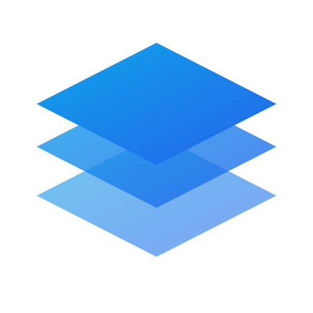

# Visual Identity

## Logo & Iconography

## Logo

The **PragmaStack** logo represents the core values of the project: structure, speed, and clarity.

  
  
<em>The Stack: Geometric layers representing the full-stack architecture.</em>

### Icon

For smaller contexts (favicons, headers), we use the simplified icon:

  

For now, we use the **Lucide React** icon set for all iconography. Icons should be used sparingly and meaningfully to enhance understanding, not just for decoration.

## Color Palette

Our color palette is derived from the **Modern Minimal** theme using the **OKLCH** color space for perceptual uniformity.

### Primary Colors

- **Primary Blue**: `oklch(0.6231 0.188 259.8145)` - Used for main actions, branding elements, and active states.
- **Background**: `oklch(1 0 0)` (Light) / `oklch(0.2046 0 0)` (Dark) - Clean, neutral backgrounds.

### Usage Guidelines

- **Dominant**: Neutral backgrounds and text (Foreground, Card, Muted).
- **Accent**: Primary Blue for calls to action.
- **Functional**: Destructive Red for errors, Success Green (custom) for success states.

> [!NOTE]
> For the full technical specification of color tokens, refer to the [Design System Foundations](../design-system/01-foundations.md#color-system-oklch).

## Typography

We use **Geist Sans** for headings and body text, and **Geist Mono** for code.

### Type Hierarchy

- **Headings**: Bold, tight tracking.
- **Body**: Regular weight, comfortable reading line height.
- **Code**: Monospaced, slightly smaller than body text.

> [!NOTE]
> For the full typography scale and usage, refer to the [Design System Foundations](../design-system/01-foundations.md#typography).

## Imagery & Graphics

- **Style**: Clean, modern, minimal.
- **Screenshots**: Use consistent padding and shadows (refer to `shadow-lg` or `shadow-xl`).
- **Illustrations**: Avoid generic stock photos. Use abstract geometric shapes or high-quality interface representations.
